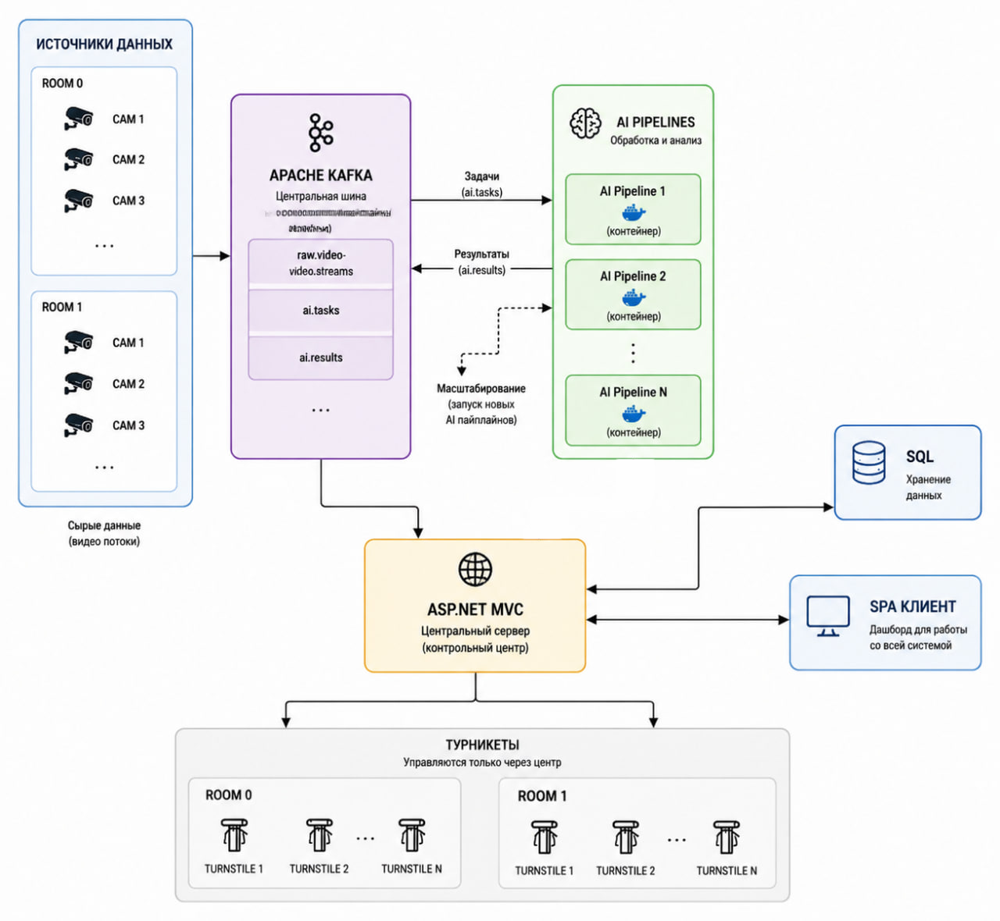

# VSpark

> Центральный сервис-оркестратор распределённой системы контроля соблюдения техники безопасности на опасных производствах.

## О проекте

**VSpark** — центральный backend-сервис программного продукта "ОКО-Пром", разработанного в рамках акселерационной программы **«Цифровая Кузница 2026»**.

Основная задача сервиса — координация взаимодействия микросервисов, предоставление API для клиентского приложения, управление пользователями, авторизация и интеграция с системой анализа видеопотока на базе компьютерного зрения.

---

# Возможности

- Авторизация и аутентификация пользователей (JWT + Refresh Tokens)
- Управление пользователями и ролями
- REST API для клиентского приложения и микросервисов
- Real-Time взаимодействие посредством SignalR
- Оркестрация окружающих микросервисов
- Интеграция с нейросетевым пайплайном анализа видеопотока
- Взаимодействие с системой управления турникетами
- Работа с базой данных посредством Entity Framework Core

---

# Архитектура



### Основные компоненты

- VSpark (центральный сервис-оркестратор)
- Нейросетевой пайплайн анализа видеопотока
- Сервис управления турникетами
- Клиентское приложение (Vue.js)
- База данных

---

# Используемые технологии

## Backend

- .NET 10
- ASP.NET Core
- REST API
- SignalR
- Entity Framework Core

## Авторизация

- JWT
- Refresh Tokens
- Authentication Schemes

## База данных

- Postgre SQL

## Контейнеризация

- Docker
- Docker Compose

## Оркестрация

- Kubernetes

## Тестирование

- NUnit

---

# Структура проекта

```
VSpark
│
├── VSpark            # Основной backend
├── VSpark.Tests      # Unit-тесты
└── docs              # Документация
```

---

# Моя роль в проекте

В рамках проекта я являлся руководителем backend-разработки и архитектором системы.

Основные зоны ответственности:

- проектирование архитектуры системы;
- разработка центрального сервиса-оркестратора VSpark;
- реализация JWT-аутентификации и авторизации;
- разработка REST API;
- интеграция SignalR;
- разработка слоя доступа к данным на Entity Framework Core;
- организация взаимодействия между микросервисами;
- написание Dockerfile;
- помощь команде в контейнеризации сервисов;
- инициирование перехода от монолитной архитектуры (Razor Pages) к распределённой.

---

# Текущее состояние проекта

🚧 Проект находится в активной разработке.

В настоящее время продолжается миграция от монолитной архитектуры к распределённой микросервисной системе. Одновременно расширяется покрытие модульными тестами и развивается инфраструктура проекта.

---

# Результаты

Проект разработан в рамках акселерационной программы **«Цифровая Кузница 2026»**.

- 🥈 2 место на университетском демо-дне.
- Отобран для дальнейшего развития в рамках программы.

---

# Планы развития

- покрытие кода модульными тестами
- развитие распределённой архитектуры;
- расширение интеграции с микросервисами;
- развитие Kubernetes-инфраструктуры, интеграция Kafka и Prometheus
- внедрение централизованного мониторинга и наблюдаемости.
